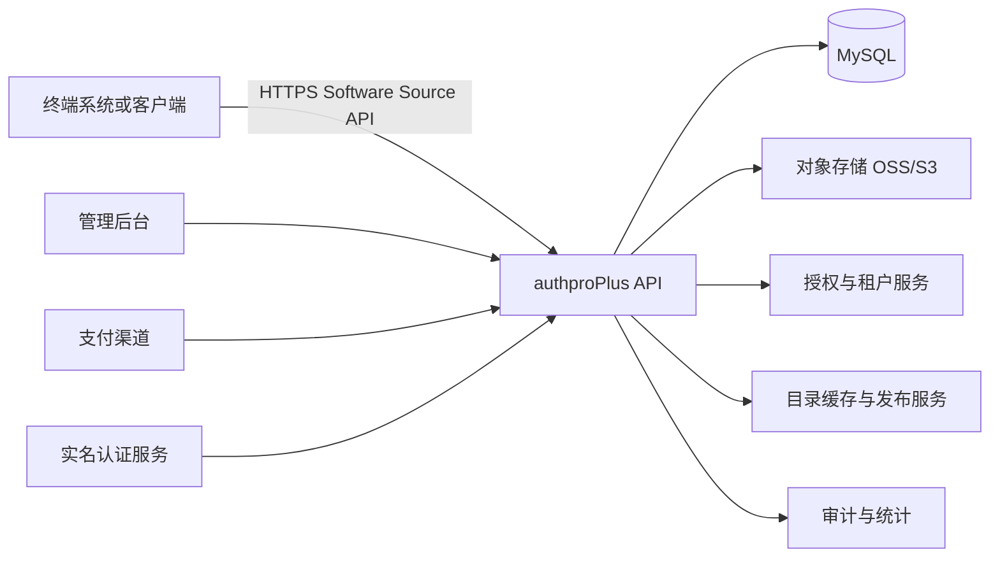

# authproPlus 软件源分发与插件生态开发设计文档

**文档版本：** 0.2.0

**编写日期：** 2026-09-16

**项目定位：** 兼容上游格式的 authproPlus 授权服务端与插件化扩展平台

**基础项目：** `cy70923167/auth_pro` 当前公开版本

## 1. 设计结论

authproPlus 的首要目标不是重新发明一套软件源协议，而是**尽量兼容上游项目现有的软件源、首页模板和插件源格式**。这样后续可以持续拉取作者的新版本，在较小冲突范围内合并更新；同时，authproPlus 的新功能优先以插件、模板和软件源资源的形式扩展，而不是直接修改上游核心代码。

终端系统继续通过上游已经使用的 Software Source API 获取主题模板、插件和相关策略。authproPlus 在兼容现有字段和接口的前提下，逐步增加授权、版本和商业分发能力。只有在现有协议无法表达新需求时，才增加带版本号的新字段或新接口。

第一阶段应优先完成协议稳定性和后台发布闭环。多租户、付费订单、代理分销和复杂广告策略应建立在稳定的资源模型与授权模型之上，不能在第一阶段直接堆叠业务页面。

本设计默认沿用当前项目的 Go、Gin、MySQL 和 Vue 技术栈。当前仓库已有授权管理、用户与代理体系、插件源、首页模板、广告、支付、实名认证和安装向导等基础代码。当前版本没有包含 README 所描述的独立 `software-source-system/` 目录，因此第一阶段只在现有软件源接入和管理逻辑周围做兼容性增强，不把它强行改造成一套完全不同的分发系统。

### 1.1 兼容性优先原则

上游同步是本项目的长期约束。所有二开都必须遵守以下规则：

1. 不修改上游已有 JSON 字段的含义，不删除已有字段，不改变已有字段类型。
2. 新字段必须是可选字段，并提供旧客户端可以忽略的默认行为。
3. 新接口使用独立的版本路径，例如 `/api/v1/plus/*`，不覆盖上游已有接口。
4. 上游文件尽量不直接修改；需要扩展时优先新增插件、适配器、配置项或独立模块。
5. 每次同步上游前先建立基线提交，并保留二开变更清单和兼容性测试。
6. 首页模板和插件包继续使用上游目录结构、Manifest 风格、版本字段和校验字段。

## 2. 目标与非目标

### 2.1 目标

本项目的目标是建立一套可被多个终端系统接入的分发协议。协议需要支持以下资源：

| 资源 | 主要用途 | 是否支持商业授权 |
| --- | --- | --- |
| 主题模板 | 替换终端首页、登录页或业务页面的声明式布局 | 可选 |
| 静态模板包 | 分发 HTML、CSS、图片和受限静态资源 | 可选 |
| 功能插件 | 扩展支付、认证、通知、数据和业务能力 | 支持 |
| 广告策略 | 按应用、租户、渠道和授权等级分发广告 | 支持 |
| 客户端版本 | 分发终端程序和更新包 | 支持 |

系统需要在兼容上游格式的前提下提供资源发布、版本管理、灰度启用、授权校验、完整性校验、临时下载、下载日志和后台运营能力。

### 2.2 非目标

第一阶段不实现任意远程 JavaScript 的执行，不允许模板仓库直接注入可执行后端代码，也不允许插件包绕过授权后在终端永久运行。插件运行模型必须在明确的安全边界内设计。

第一阶段也不承诺兼容作者未公开的私有服务端接口。当前项目已有的 API 只能作为本地二开基础，不能推断为作者服务端的完整协议。

## 3. 当前代码基础与差距

当前项目已经具备下列可复用能力：

- Go + Gin 后端和 Vue 前端的同源部署模式。
- 管理员、用户和代理账户体系。
- 角色、菜单和接口权限基础。
- JWT 普通 Token 与 Refresh Token。
- 应用版本、版本检查和更新包下载接口。
- 插件源、首页模板和软件源缓存逻辑。
- 模板 JSON、版本字段、SHA-256 校验和启用流程。
- 广告管理基础接口与前端展示 Hook。
- 支付配置和支付流程基础。
- 实名认证配置与第三方认证流程基础。
- 安装向导、数据库初始化和迁移逻辑。

当前需要补齐或重构的部分如下：

| 差距 | 处理建议 |
| --- | --- |
| 软件源管理端未形成独立完整模块 | 先沿用现有软件源、插件源和首页模板管理；只新增缺失页面和服务层 |
| 软件源协议的资源类型不统一 | 先兼容现有 `plugins`、`homeTemplates` 和目录字段；Plus 字段只做可选扩展 |
| Token 当前主要通过 JSON 返回 | 增加 HttpOnly Cookie 模式，并保留兼容模式 |
| 更新包的 `signature` 当前为空 | 增加数字签名校验，SHA-256 只作为完整性校验 |
| JSON 模板与静态 ZIP 模板边界不清晰 | 采用两种明确的安装器和权限模型 |
| 多租户隔离不完整 | 增加 tenant_id，并为管理、资源、订单和日志建立隔离规则 |
| OSS 私有读写未形成统一抽象 | 增加 Storage Provider 接口和临时 URL 服务 |
| 插件运行时安全边界不足 | 第一阶段只做声明式和受限静态插件，执行型插件后置 |

## 4. 总体架构



authproPlus 在第一阶段采用模块化单体。所有模块共享一个 Go 进程和 MySQL 数据库，但必须通过清晰的 service、repository 和 handler 边界组织代码。这样可以减少部署复杂度，同时为后续拆分软件源服务保留接口边界。

建议的模块边界如下。第一阶段不要求一次性创建全部新目录；能通过现有 `handler`、`softwaresource` 和插件接口完成的功能，不应为了架构重构而改动上游文件：

```text
backend/
├── handler/          # 优先复用的上游 API 和管理入口
├── softwaresource/   # 兼容上游 Software Source API 的接入层
├── plugin/           # Plus 插件适配器和生命周期
├── extension/        # 新增 Plus 功能，不直接污染上游核心
├── distribution/     # 下载授权、临时地址和分发审计
├── storage/          # 本地、OSS、S3 存储抽象
├── middleware/       # JWT、权限、限流和安全策略
└── config/           # 环境变量和运行配置
```

## 5. 核心业务模型

### 5.1 租户模型

租户是软件源生态中的最小业务隔离单元。平台管理员可以管理所有租户，租户管理员只能管理本租户的资源、商品、订单和终端。

建议增加以下表：

```text
tenants
- id
- tenant_key
- name
- status
- plan_code
- created_at
- updated_at

tenant_members
- id
- tenant_id
- user_id
- role_id
- status
- created_at

tenant_domains
- id
- tenant_id
- domain
- verified_at
- status
```

所有属于租户的表必须包含 `tenant_id`，包括资源、版本、商品、授权、订单、广告策略、下载日志和发布记录。后台查询必须通过上下文中的租户 ID 过滤，不能依赖前端传入的租户 ID。

### 5.2 软件源与目录

```text
software_sources
- id
- tenant_id
- source_key
- name
- description
- api_key_hash
- signing_key_id
- status
- revision
- created_at
- updated_at

source_bindings
- id
- source_id
- resource_type
- resource_id
- visibility
- sort_order
- published_at
```

软件源是目录的发布边界。一个租户可以创建多个软件源，例如正式源、测试源、渠道源和私有源。终端只应看到绑定到其软件源的已发布资源。

### 5.3 统一资源模型

插件、模板、广告策略和客户端版本都应抽象为资源，但资源的安装方式不同。统一模型可以减少目录接口的重复逻辑。

```text
resources
- id
- tenant_id
- resource_key
- resource_type
- name
- description
- vendor
- status
- visibility
- current_release_id
- created_at
- updated_at

resource_releases
- id
- resource_id
- version
- channel
- min_client_version
- max_client_version
- manifest_json
- package_id
- sha256
- signature
- file_size
- force_update
- release_notes
- status
- published_at
- created_at

packages
- id
- tenant_id
- storage_provider
- storage_key
- original_name
- content_type
- file_size
- sha256
- signature
- status
- created_at
```

版本号使用 SemVer 兼容格式。正式环境发布后不允许覆盖同一资源的同一版本；如果内容发生变化，必须创建新的构建号或补丁版本。

### 5.4 商品与授权

商业插件不应直接把“下载地址”当作权限。终端请求下载时，服务端需要验证资源版本、租户、终端身份和授权状态。

```text
products
- id
- tenant_id
- resource_id
- product_type
- price
- currency
- billing_cycle
- status

entitlements
- id
- tenant_id
- subject_type
- subject_id
- resource_id
- product_id
- status
- starts_at
- expires_at
- limits_json

orders
- id
- tenant_id
- buyer_type
- buyer_id
- amount
- currency
- payment_channel
- status
- provider_order_no
- created_at
- paid_at
```

下载权限由 entitlement service 统一判断。支付回调只负责更新订单状态，不能直接修改前端传入的授权结果。

## 6. Software Source API 设计

### 6.1 认证方式

终端首次接入时使用软件源 API Key 或设备注册凭证。API Key 不应保存明文，服务端只保存哈希值。正式下载和高价值资源请求应使用带时间戳、随机数和请求体摘要的 HMAC 签名。

请求头建议如下：

```http
Authorization: Bearer <access-token>
X-Source-Key: <source-key>
X-Client-ID: <client-id>
X-Client-Version: 1.2.3
X-Timestamp: 1726500000
X-Nonce: 2d9e3c...
X-Signature: sha256=...
```

签名原文建议固定为：

```text
HTTP_METHOD + "\n" + PATH + "\n" + TIMESTAMP + "\n" + NONCE + "\n" + SHA256(BODY)
```

服务端需要校验时间窗口、Nonce 重放和签名密钥状态。管理后台使用 JWT；浏览器管理端默认使用 HttpOnly、Secure、SameSite Cookie。

### 6.2 目录接口

所有接口返回统一响应结构：

```json
{
  "code": 200,
  "message": "ok",
  "requestId": "req_01J...",
  "data": {}
}
```

建议的只读目录接口如下：

| 方法 | 路径 | 作用 |
| --- | --- | --- |
| GET | `/api/v1/catalog/manifest` | 获取软件源整体版本和能力声明 |
| GET | `/api/v1/catalog/sources` | 获取当前客户端可见的软件源信息 |
| GET | `/api/v1/catalog/resources` | 按类型、版本和标签查询资源 |
| GET | `/api/v1/catalog/plugins` | 查询插件目录 |
| GET | `/api/v1/catalog/templates` | 查询主题和模板目录 |
| GET | `/api/v1/catalog/advertisements` | 获取当前上下文适用的广告策略 |
| GET | `/api/v1/resources/:key/releases` | 获取资源版本历史 |
| GET | `/api/v1/resources/:key/releases/latest` | 获取指定渠道的最新版本 |
| POST | `/api/v1/resources/:key/releases/:id/resolve` | 解析授权和客户端兼容性 |
| POST | `/api/v1/packages/:id/download-token` | 签发短期下载凭证 |
| GET | `/api/v1/packages/:id/download` | 使用凭证下载软件包 |
| POST | `/api/v1/installations/report` | 上报安装、启用和卸载事件 |
```

### 6.3 Manifest 示例

```json
{
  "schemaVersion": 1,
  "source": {
    "key": "official",
    "name": "authproPlus 官方软件源",
    "revision": 42
  },
  "capabilities": [
    "plugins",
    "templates",
    "advertisements",
    "client-updates"
  ],
  "resources": [
    {
      "key": "fintech-gold",
      "type": "template",
      "version": "1.2.0",
      "channel": "stable",
      "minClientVersion": "1.0.0",
      "sha256": "...",
      "signature": "ed25519:...",
      "downloadRequired": true
    }
  ],
  "generatedAt": "2026-09-16T14:00:00Z"
}
```

Manifest 只包含目录和安全元数据，不直接暴露永久下载地址。下载地址应通过短期 Token 或对象存储临时地址生成。

## 7. 插件与模板安全模型

### 7.1 声明式模板

声明式模板是第一阶段的默认扩展方式。模板只能表达颜色、文案、图片、图标、布局区块和允许的动作。渲染器必须执行字段白名单、长度限制、URL 协议限制和 schema 版本校验。

禁止模板执行任意 JavaScript、访问浏览器 Cookie、修改 localStorage 中的认证信息或发起未声明的跨域请求。

### 7.2 静态模板包

静态 ZIP 模板只允许包含 HTML、CSS、图片、字体和受限 JSON。安装前必须检查：

- ZIP 总大小和单文件大小。
- 解压后的文件总数和总大小。
- 路径不能包含 `..`，不能写入安装目录之外。
- 禁止符号链接和设备文件。
- 禁止可执行文件扩展名。
- HTML 中禁止加载未知远程脚本。
- 包签名和 SHA-256 必须通过校验。

### 7.3 插件运行模型

插件分为三类：

| 类型 | 第一阶段策略 | 运行位置 |
| --- | --- | --- |
| 声明式插件 | 支持 | 前端渲染器或配置层 |
| 静态资源插件 | 支持 | 前端受限资源目录 |
| 服务端执行插件 | 暂缓 | 后续采用独立进程或 WASM 沙箱 |

服务端执行插件不能直接加载到主 Go 进程中。后续如果确有需求，应采用独立进程、最小权限账户、资源限制、签名包和版本回滚机制。

### 7.4 签名与完整性

SHA-256 用于判断下载内容是否损坏，不能证明发布者身份。正式发布需要使用 Ed25519 签名。服务端发布时生成签名，客户端内置公钥并验证签名。密钥轮换通过 `keyId`、生效时间和撤销状态完成。

## 8. 广告策略设计

广告资源与广告策略分离。资源负责图片、视频或文字内容；策略负责展示条件。

```text
advertisement_assets
- id
- tenant_id
- package_id
- content_type
- sha256
- status

advertisement_campaigns
- id
- tenant_id
- name
- status
- starts_at
- ends_at
- budget

advertisement_rules
- id
- campaign_id
- position
- audience_json
- channel_json
- priority
- frequency_json
```

服务端根据终端版本、软件源、渠道、租户、授权等级和时间窗口筛选策略。返回结果不包含管理字段，也不返回 OSS 永久凭证。资源地址必须是短期防盗链地址。

## 9. 管理后台设计

软件源后台建议新增以下菜单：

```text
软件源中心
├── 软件源列表
├── 目录预览
├── 发布任务
└── API 凭证

资源中心
├── 插件管理
├── 主题模板
├── 广告策略
├── 客户端版本
└── 软件包

商业中心
├── 商品管理
├── 订单管理
├── 授权记录
├── 代理分销
└── 收入统计

运营审计
├── 下载日志
├── 安装事件
├── 发布审计
├── 签名密钥
└── 安全事件
```

所有按钮权限使用明确的权限码，例如：

```text
catalog:source:view
catalog:source:publish
resource:plugin:create
resource:plugin:release
package:download:resolve
order:refund:review
security:key:rotate
```

后台页面不应只依赖隐藏按钮实现安全控制。每个写操作必须由后端权限中间件和业务层再次校验。

## 10. 安全要求

系统必须默认使用 HTTPS。生产环境禁止使用通配的跨域配置。管理 Cookie 使用 `HttpOnly`、`Secure` 和合适的 `SameSite` 属性。刷新 Token 必须支持轮换和撤销，不能长期复用同一个 Refresh Token。

下载接口需要执行以下检查：

1. 资源处于已发布状态。
2. 客户端版本满足最低版本要求。
3. 当前终端属于允许的软件源或租户。
4. 当前主体拥有有效 entitlement。
5. 下载凭证未过期且未超过使用次数。
6. 请求签名、Nonce 和时间窗口有效。
7. 文件状态、哈希和签名均已通过校验。

系统需要记录管理员发布、资源启停、授权变更、下载签发、安装上报和签名密钥变更。敏感字段不得写入普通日志。

## 11. 部署设计

### 11.1 开发环境

开发环境继续采用同源部署：Go 后端监听 `19127`，前端构建产物复制到 `backend/static`，MariaDB 提供数据库。

建议使用环境变量：

```bash
PORT=19127
AUTO_PRO_DATA_DIR=/opt/authproplus/data
AUTO_PRO_FRONTEND_DIR=/opt/authproplus/frontend/current
AUTO_PRO_DB_HOST=127.0.0.1
AUTO_PRO_DB_PORT=3306
AUTO_PRO_DB_NAME=auth_pro
AUTO_PRO_DB_USER=authpro
AUTO_PRO_DB_PASSWORD=change-me
AUTO_PRO_STORAGE_PROVIDER=local
AUTO_PRO_STORAGE_DIR=/opt/authproplus/packages
AUTO_PRO_PUBLIC_BASE_URL=https://plus.example.com
```

### 11.2 生产环境

生产部署建议使用 Nginx 或同类反向代理终止 TLS。Go 服务只监听本机或内网地址。对象存储使用私有 Bucket，所有下载通过服务端签发短期 URL。数据库必须单独备份，备份文件不得与公开软件包目录放在同一目录。

第一阶段采用单体部署，达到以下条件后再考虑拆分软件源服务：目录请求明显占用主服务资源；下载流量影响授权 API；需要独立扩容；或不同租户需要独立部署和计费。

## 12. 开发阶段与验收标准

### 阶段零：上游同步基线

先固定上游版本、记录上游提交哈希，并把所有二开修改集中在独立提交或独立目录。同步新版本时，先拉取上游并运行原有测试，再合并 Plus 扩展。任何需要修改上游核心文件的变更都必须记录原因、冲突风险和回滚方式。

验收时，能够从上游拉取新版本，完成冲突分析，并保留现有首页模板、插件源和授权功能的回归测试结果。

### 阶段一：兼容格式和配置基础

先实现对现有软件源目录格式的兼容读取和发布。重点覆盖 `plugins`、`homeTemplates`、相对模板路径、版本号、SHA-256 和缓存字段。Plus 扩展字段全部使用可选字段。

验收时，原有终端可以继续读取目录和模板；新终端可以读取可选的 Plus 字段；服务端不会返回永久下载地址。

### 阶段二：插件化扩展闭环

把新增支付适配、实名认证适配、通知渠道、广告策略、主题模板和运营工具设计为插件或模板资源。核心服务只提供稳定的生命周期、配置、权限、存储和事件接口。

验收时，安装、启用、停用和升级一个扩展不需要修改上游核心业务表；扩展异常可以被禁用，并且不会阻断登录、授权校验和软件源读取。

### 阶段三：后台发布闭环

完成插件、模板、广告策略和软件包管理页面。验收时，管理员可以创建资源、上传包、填写版本、生成 SHA-256、提交发布、撤回发布并查看审计日志。

### 阶段四：授权与商业闭环

完成商品、订单、授权记录和下载权限。验收时，未购买主体无法下载商业资源；授权过期后下载 Token 不能继续签发；支付回调重复提交不会重复开通授权。

### 阶段五：安全增强

完成 HttpOnly Cookie、Refresh Token 轮换、Ed25519 签名、Nonce 防重放、限流和密钥轮换。验收时，篡改包、过期 Token、重复 Nonce、错误租户和无权限按钮请求都会被拒绝。

### 阶段六：多租户与运营

完成租户、成员、域名、渠道、广告规则和统计看板。验收时，租户之间不能读取资源、订单、下载日志和广告数据；平台管理员可以执行跨租户审计。

## 13. 测试策略

后端测试覆盖 Manifest 校验、版本比较、签名校验、授权判断、租户隔离、下载 Token、路径安全和幂等回调。数据库测试使用独立数据库，不允许测试直接连接生产库。

前端测试覆盖软件源列表、资源发布、版本撤回、权限按钮、订单状态和模板预览。端到端测试至少验证首次安装、管理员登录、资源发布、终端目录读取和受授权下载流程。

安全测试重点包括 ZIP 路径穿越、符号链接逃逸、越权读取、租户 ID 篡改、重放攻击、签名替换、下载地址复用和跨域 Cookie 风险。

## 14. 主要风险与决策

**上游版本持续变化。** 直接大规模修改核心文件会导致后续同步困难。因此 Plus 功能默认使用插件、模板、适配器和新增模块实现；必须修改核心时，优先采用最小补丁，并增加与上游版本的兼容测试。

**私有服务端协议不可见。** 当前公开仓库不能证明作者私有服务端的全部实现。authproPlus 应兼容当前公开格式，并将 Plus 扩展放在独立版本路径或可选字段中，不应依赖作者未公开的私有行为。

**执行型插件风险较高。** 第一阶段只支持声明式和静态资源插件。执行型插件必须等沙箱和签名机制完成后再开放。

**商业授权容易被绕过。** 下载地址不能作为授权凭证。授权判断必须发生在服务端，并且下载 Token 需要短期有效、绑定主体和资源版本。

**多租户改造会影响现有查询。** 在引入 `tenant_id` 前，需要完成数据归属迁移和默认租户策略。不能直接给现有表添加非空字段后上线。

**软件源服务可能成为流量瓶颈。** 软件包应放在对象存储，API 只负责鉴权和签发临时地址。不要让 Go 主服务长期代理大文件下载，除非有明确的审计或加密需求。

## 15. 第一批实施任务

建议下一轮直接实施以下内容，顺序以减少上游合并冲突为优先：

1. 建立上游同步分支、版本基线和二开变更清单。
2. 将当前固定软件源 URL 和 API Key 改为兼容的环境变量配置，并提供 `.env.example`。
3. 为现有 `plugins` 和 `homeTemplates` 格式增加兼容性测试，禁止改变原字段含义。
4. 建立 Plus 插件清单、插件生命周期和插件配置接口。
5. 把新增支付、实名、通知和广告功能先实现为插件适配器，不直接改上游业务流程。
6. 在现有软件源接口上增加可选的授权元数据和下载 Token，不替换已有目录字段。
7. 增加 SHA-256 校验，并预留 Ed25519 签名字段和 `keyId`。
8. 增加下载日志、安装事件日志和插件运行日志。
9. 为后台增加插件管理和扩展配置菜单，沿用现有 RBAC 权限体系。
10. 完成上游原有测试、Plus 扩展测试和最小端到端测试。

## 16. 版本规划

```text
v0.1  上游同步基线、兼容性测试和软件源配置
v0.2  插件清单、生命周期和扩展配置
v0.3  模板/插件/广告的兼容发布与下载授权
v0.4  商品、订单、授权和付费插件
v0.5  HttpOnly Cookie、签名、密钥轮换和安全审计
v0.6  多租户、渠道分发和代理分销
v1.0  稳定兼容版本、迁移工具、部署文档和生产验收
```

每个版本必须同时更新数据库迁移、API 文档、前端权限菜单、接口测试和回滚说明。未完成回滚验证的数据库变更不得进入生产发布。

## References

[1]: https://github.com/cy70923167/auth_pro "auth_pro 基础项目仓库"

[2]: https://www.rfc-editor.org/rfc/rfc9110 "HTTP Semantics"

[3]: https://www.rfc-editor.org/rfc/rfc7519 "JSON Web Token (JWT)"

[4]: https://www.rfc-editor.org/rfc/rfc8032 "Edwards-Curve Digital Signature Algorithm (EdDSA)"

[5]: https://owasp.org/www-project-application-security-verification-standard/ "OWASP Application Security Verification Standard"

[6]: https://owasp.org/www-community/attacks/Path_Traversal "OWASP Path Traversal"

[7]: https://semver.org/ "Semantic Versioning 2.0.0"

[8]: https://cheatsheetseries.owasp.org/cheatsheets/Session_Management_Cheat_Sheet.html "OWASP Session Management Cheat Sheet"

[9]: https://cheatsheetseries.owasp.org/cheatsheets/File_Upload_Cheat_Sheet.html "OWASP File Upload Cheat Sheet"

[10]: https://docs.aws.amazon.com/AmazonS3/latest/userguide/ShareObjectPreSignedURL.html "Amazon S3 Presigned URLs"

[11]: https://help.aliyun.com/zh/oss/user-guide/overview-of-oss-signature-version-4 "阿里云 OSS V4 签名概述"

[12]: https://www.mysql.com/ "MySQL 数据库"

[13]: https://go.dev/ "Go 编程语言"

[14]: https://vuejs.org/ "Vue.js"

[15]: https://gin-gonic.com/ "Gin Web Framework"

---

**文档状态：** 设计草案，已纳入“兼容上游格式、可持续同步、功能优先插件化”的约束，待评审后进入实施。

**建议评审人：** 项目负责人、后端开发、前端开发、运维和安全负责人。

**下一步：** 先评审第 1.1 节兼容性原则、第 7 节插件安全模型和第 12 节上游同步基线，再开始新增插件接口和兼容性测试。

作者：**Manus AI**
